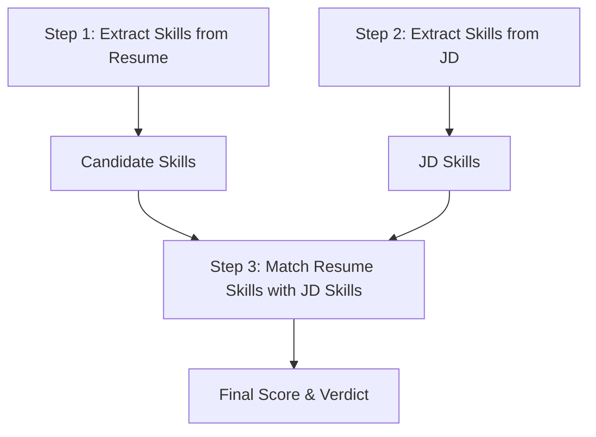

# Day 8 - Prompt Chaining

On Day 8, we learn about **Prompt Chaining**. This design pattern involves breaking down a complex task into a series of smaller, sequential steps, where the output of one step becomes the input for the next step.

---

## What is Prompt Chaining?
Instead of asking an LLM to perform a massive, multi-part task in a single prompt (which often leads to formatting errors, ignored instructions, or poor accuracy), we split it into a workflow of smaller steps.

For example, to evaluate how well a resume fits a job description, we chain three steps:


---

## Why Use Prompt Chaining?
- **Higher Accuracy**: LLMs perform much better when focused on one specific sub-task at a time.
- **Easier Debugging**: You can inspect intermediate outputs to see where a failure happened (e.g., did the parser fail to extract skills, or did the matcher fail to compare them?).
- **Granular Control**: You can use different models, temperatures, or system prompts for different steps in the chain.
- **Modular**: Each step can be tested and improved independently.
- **Cost-effective**: You can use different models for different steps in the chain.
- **Easier Maintenance**: You can easily update or replace a single step without affecting the entire chain.
---

## Step-by-Step Workflow in `prompt_chaining.py`

### Step 1: Extract Resume Skills
Ask the LLM to read the resume and extract a clean list of skills.
- **System Prompt**: *"You are a professional HR assistant. Extract the skills from the resume provided..."*

### Step 2: Extract JD Skills
Ask the LLM to read the Job Description and extract the key required skills.
- **System Prompt**: *"You are a professional HR assistant. Extract the skills from the job description provided..."*

### Step 3: Match and Score
Pass both extracted skill lists to the final prompt to compare them and calculate a fit percentage.
- **System Prompt**: *"Compare the skills of the candidate and JD skills and produce a final score..."*

---

## Code Example

Here is how the chain is orchestrated in Python:

```python
# 1. Extract resume skills
candidate_skills = step1_resume_skills()
print("Extracted Candidate Skills:\n", candidate_skills)

# 2. Extract JD skills
jd_skills = step2_jd_skills()
print("Extracted JD Skills:\n", jd_skills)

# 3. Match skills
final_result = step3_match_skills(candidate_skills, jd_skills)
print("Final Fit Match & Verdict:\n", final_result)
```

---

## Running the Example

1. Make sure dependencies are installed:
   ```bash
   pip install -r requirements.txt
   ```
2. Run the python script:
   ```bash
   python prompt_chaining.py
   ```
